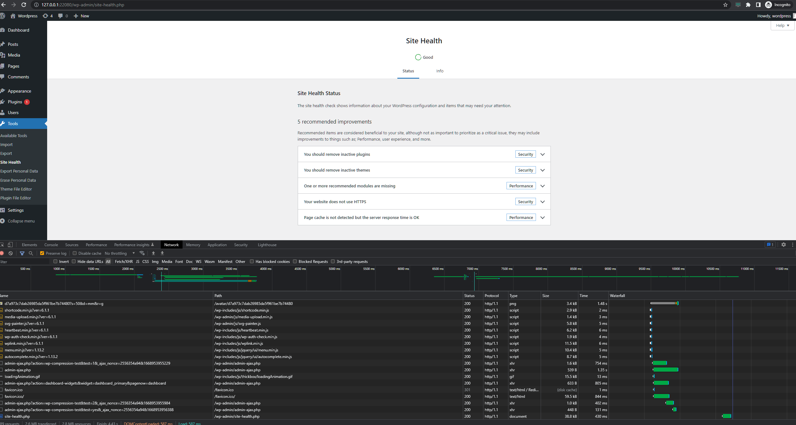

# Linux CentOS Vagrant
Vagrant file:  
```vagrant
Vagrant.configure("2") do |config|
  config.vm.box = "TimeS-Dev/centos7wpse"
  config.vm.box_version = "0.0.1"
  config.vm.network "forwarded_port", guest: 80, host: 80, id: "nginx"
  config.vm.network "forwarded_port", guest: 22080, host: 22080, id: "wordpress"

  config.vm.provision "shell", path: "scripts/provision.sh"
end
```

Changing the port of the app and adding new vhost to the nginx site config:  
**NOTE: the solution below may seem redundant, probably was better to change the port in _wp_options_ table to 80 and 
it would work just fine.**
```bash
sed -i -E 's/listen  80/listen  22080/' /etc/nginx/conf.d/test.site.conf
cat << EOF >> /etc/nginx/conf.d/test.site.conf
server {
  listen 80;

  server_name proxy;

  location / {
      proxy_pass http://127.0.0.1:22080;

      proxy_redirect off;
      proxy_http_version 1.1;
  }
}
EOF
```

There are missing permissions and modules. Adding missing dependencies and allowing access:  
```bash
yum install -y php-gd
chcon -R -t httpd_sys_rw_content_t /var/www/html/test.site/
```

Now the app is healthy:

