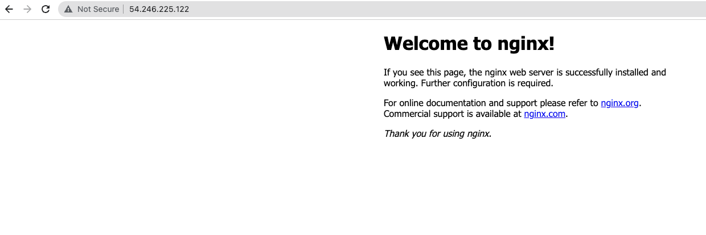
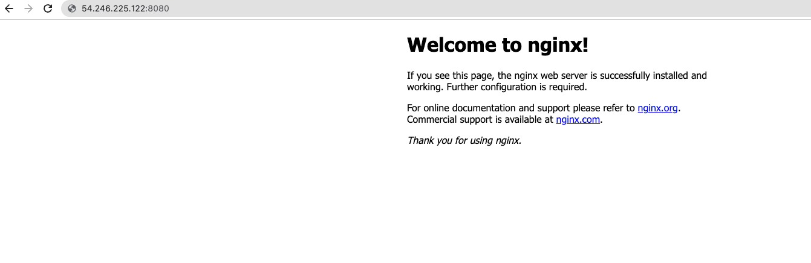
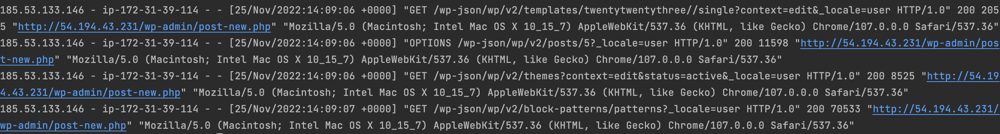
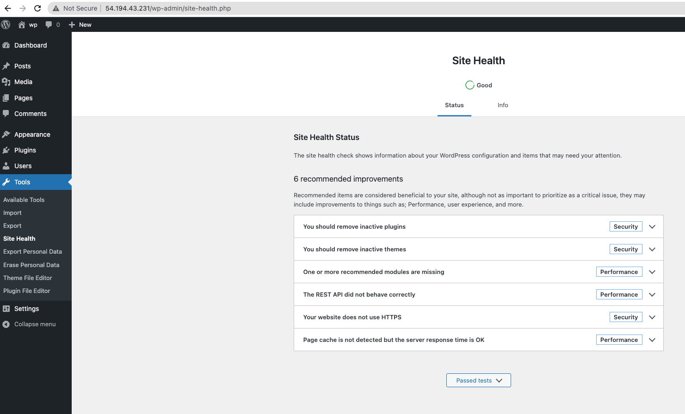
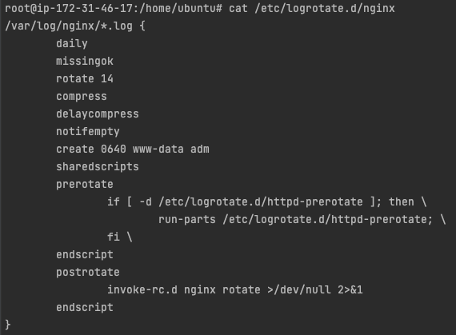
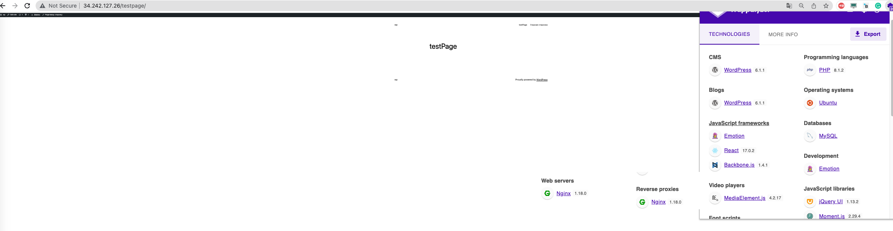
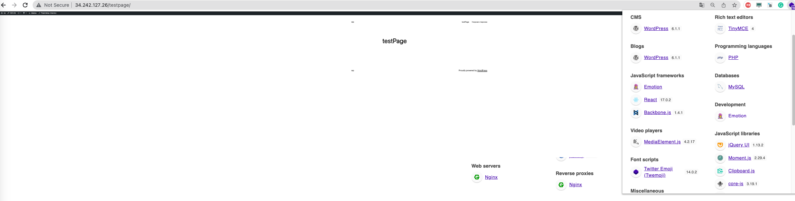

# Nginx

### Nginx - php-fpm - mysql - wordpress

1. Installation 
```bash
# set path to your ssh-key
terraform init
terraform apply
```

2. Nignx proxy port: 80, nginx backend (virtual host) port 8080:
  
  


Logs:  
```
log_format custom '$http_x_forwarded_for - $hostname - $remote_user [$time_local] "$request" '
                  '$status $body_bytes_sent "$http_referer" '
                  '"$http_user_agent"';
```
  

3. Wordpress  
  

4. Cache:  
```bash
proxy_cache_path /var/cache/nginx/wordpress keys_zone=mycache:10m loader_threshold=300 loader_files=200;
# -----
#    set $not_cached 1;
#        if ($request_uri ~* "htm_source") {
#            set $not_cached 0;
#    } 
# -----
#    proxy_cache        mycache;
#    proxy_cache_key    $scheme$host$request_uri;
#    proxy_no_cache     $not_cached;
#    proxy_cache_valid any 1h;
#    add_header X-Cache-Status $upstream_cache_status;
# -----
```


5. Logrotate  
  

Adding cron job:  
```bash
echo "0 0 * * * /usr/bin/find /tmp  -type f -ctime +14  -size +5M -exec rm -rf {} \;" >> /etc/crontab
```
6. Versioning:  
  
  
