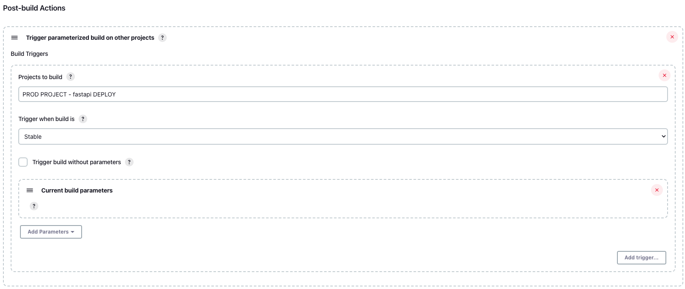
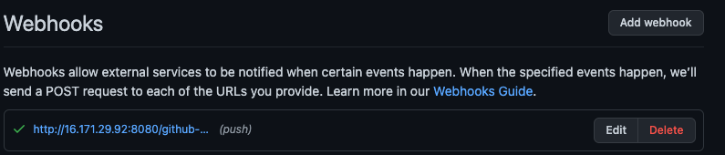

# Jenkins Pipelines + Python app
The current repository is for Jenkins and the app-server infrastructure.  
The app repository - [https://github.com/imakeeva1qa/fastapp](https://github.com/imakeeva1qa/fastapp).  

SETUP: 
```bash
# for both jenkins and app_server
terraform init
terraform plan
terraform apply 
```

Jenkins requires the following steps to be set up:  
1. install standard plugins and
2. ansible plugin
3. parameterized build plugin
4. add ssh-key for github (credentials)
5. add ssh-key for web-server access (credentials)
6. Create needed pipelines using UI. All steps are scripted and placed upon the app repository 
7. Create web-hook(s)

RESULTS:  
1. Jenkins installed using terraform and bash script
2. Project staging - build and deploy python simple app on port 80
  
list of the projects:  
  
application - [https://github.com/imakeeva1qa/fastapp](https://github.com/imakeeva1qa/fastapp)  
3. Deployment - using ansible - [https://github.com/imakeeva1qa/fastapp/tree/staging/deployment/ansible](https://github.com/imakeeva1qa/fastapp/tree/staging/deployment/ansible)
4. Dependency build-deployment is implemented using Parameterized Build plugin

5. Artifact is a docker image, stored in AWS ECR. It can be tagged like build_1, build_2 etc and will be stored according
to the ECR repository policies.
6. - for backups - see above
7. The pipeline includes build-push-test-deploy stages. [https://github.com/imakeeva1qa/fastapp/blob/staging/deployment/Jenkinsfile](https://github.com/imakeeva1qa/fastapp/blob/staging/deployment/Jenkinsfile)
8. Webhooks are implemented using github plugin and github webhooks.
 
9. For prod is used different ECR repository and main branch in pipelines' paremeters

10. For prod the different port is used - 8080:
  
11. For dependency is used the same as for point 4.
12. Slightly adjusted webhook is used for prod.

