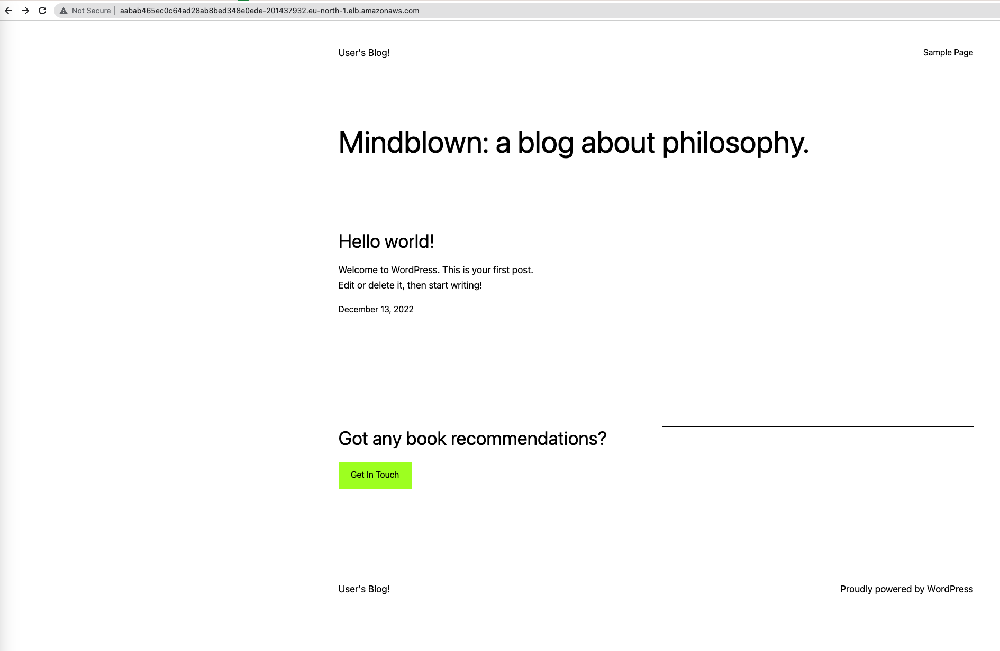

# ArgoCD

Bitnami/wordpress discards to work on M1 Silicon chip without any workarounds. So I ran it upon AWS EKS service  
```bash
eksctl apply -f cluster.yaml
```

**Application repository:** [https://github.com/imakeeva1qa/helm-charts/tree/main/bitnami/wordpress](https://github.com/imakeeva1qa/helm-charts/tree/main/bitnami/wordpress)

## Misc - cluster adjustment
By default, the cluster cannot process dynamic pvc provisioning. Used the following to fix this:  
Creation service account and csi driver. Link [https://docs.bitnami.com/kubernetes/faq/troubleshooting/troubleshooting-persistence-volumes/](https://docs.bitnami.com/kubernetes/faq/troubleshooting/troubleshooting-persistence-volumes/)  
```bash
# Identity provider. Pick your region and cluster
eksctl utils associate-iam-oidc-provider --region=eu-north-1 --cluster=argocd-cluster --approve
```

```bash
# Associate cluster with service account
eksctl create iamserviceaccount \
        --name ebs-csi-controller-sa \
        --namespace kube-system \
        --cluster argocd-cluster \
        --attach-policy-arn arn:aws:iam::aws:policy/service-role/AmazonEBSCSIDriverPolicy \
        --approve \
        --role-only \
        --role-name AmazonEKS_EBS_CSI_DriverRole \
        --override-existing-serviceaccounts

kubectl annotate serviceaccount ebs-csi-controller-sa \
        -n kube-system \
        eks.amazonaws.com/role-arn=arn:aws-cn:iam::<account_id>:role/AmazonEKS_EBS_CSI_DriverRole

# deploy csi driver
kubectl apply -k "github.com/kubernetes-sigs/aws-ebs-csi-driver/deploy/kubernetes/overlays/stable/?ref=release-1.13"
```

## ArgoCD deploying

```bash
kubectl create namespace argocd
kubectl create namespace wordpress    # for further application deployment
kubectl apply -n argocd -f https://raw.githubusercontent.com/argoproj/argo-cd/stable/manifests/install.yaml
```
After the ArgoCD is deployed it can be exposed to work with the UI interface:  
```bash
# port is random (31433), pick any you like
kubectl patch svc argocd-server -n argocd --type='json' -p '[{"op":"replace","path":"/spec/type","value":"NodePort"},{"op":"replace","path":"/spec/ports/0/nodePort","value":31433}]'
```
_Note_: in case you want to access it by nodeport directly, add the inbound rule to the security group for the port above.  

When the CD is ready, we can log in into it:  

```bash
# shows the temp admin pass:
kubectl -n argocd get secret argocd-initial-admin-secret -o jsonpath="{.data.password}" | base64 -d
```

```bash
# installing argocd cli for mac
brew  install argocd
```

```bash
# Login
argocd login 16.170.224.39:31433 --insecure
argocd cluster list

# SERVER                          NAME        VERSION  STATUS      MESSAGE  PROJECT
# https://kubernetes.default.svc  in-cluster  1.23+    Successful  
```

## Wordpress deploying

```bash
# using bitnami/wordpress
argocd app create wordpress --repo https://github.com/imakeeva1qa/helm-charts.git --path bitnami/wordpress \
       --dest-server https://kubernetes.default.svc --dest-namespace wordpress 
       
argocd app sync wordpress
argocd app set wordpress --sync-policy automated    # autodeployment
```
  



## Users

```bash
# applying policies
kubectl apply -f argocd-cm.yml
kubectl apply -f argocd-rbac.yml
argocd account list

# output:
# NAME    ENABLED  CAPABILITIES
# admin   true     login
# deploy  true     apiKey, login

argocd account can-i sync applications '*/*'
argocd account can-i sync applications 'wordpress/wordpress'
argocd account can-i create applications '*/*'
```
Output:   
  

## Telegram Notifications
Create a tg bot and grab the api_token.  
Create a channel, make the bot an admin, and post a message in there.  
```bash
# get the tg channel id. Should look like '-19928498324' or so
curl https://api.telegram.org/bot<tg_token>/getUpdates

# grab official notifications_catalog
kubectl apply -n argocd -f https://raw.githubusercontent.com/argoproj/argo-cd/stable/notifications_catalog/install.yaml

# apply secrets with TG bot token
kubectl apply -f tg_secret.yaml    
```


Adding context and subscription  
```bash
# put tg channel id into the last command below
kubectl patch cm argocd-notifications-cm -n argocd --type merge -p '{"data":{"context": "argocdUrl: https://16.170.224.39:31433","service.telegram": "token: $telegram-token"}}'
kubectl patch app wordpress -n argocd -p '{"metadata": {"annotations": {"notifications.argoproj.io/subscribe.on-deployed.telegram": "-1001814261230","notifications.argoproj.io/subscribe.on-sync-failed.telegram": "-1001814261230","notifications.argoproj.io/subscribe.on-sync-running.telegram": "-1001814261230","notifications.argoproj.io/subscribe.on-sync-succeeded.telegram": "-1001814261230"}}}' --type merge
```

