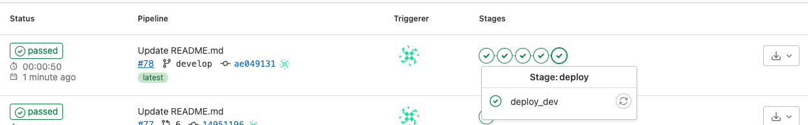
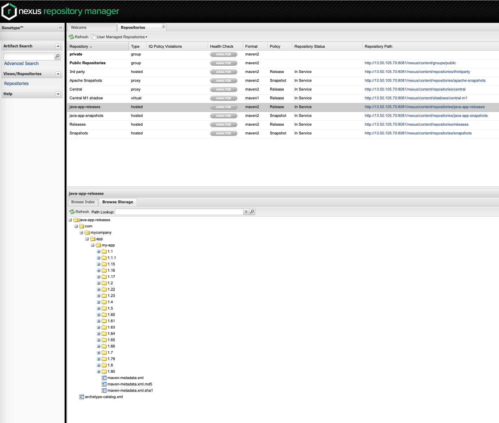
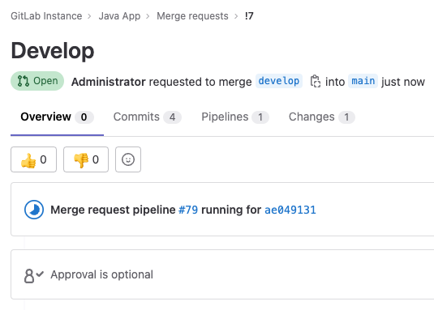
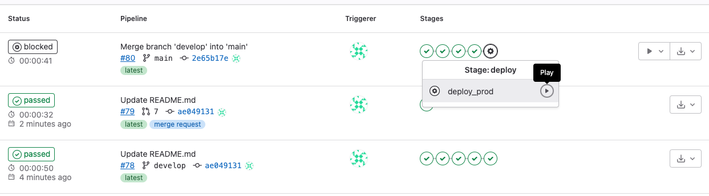
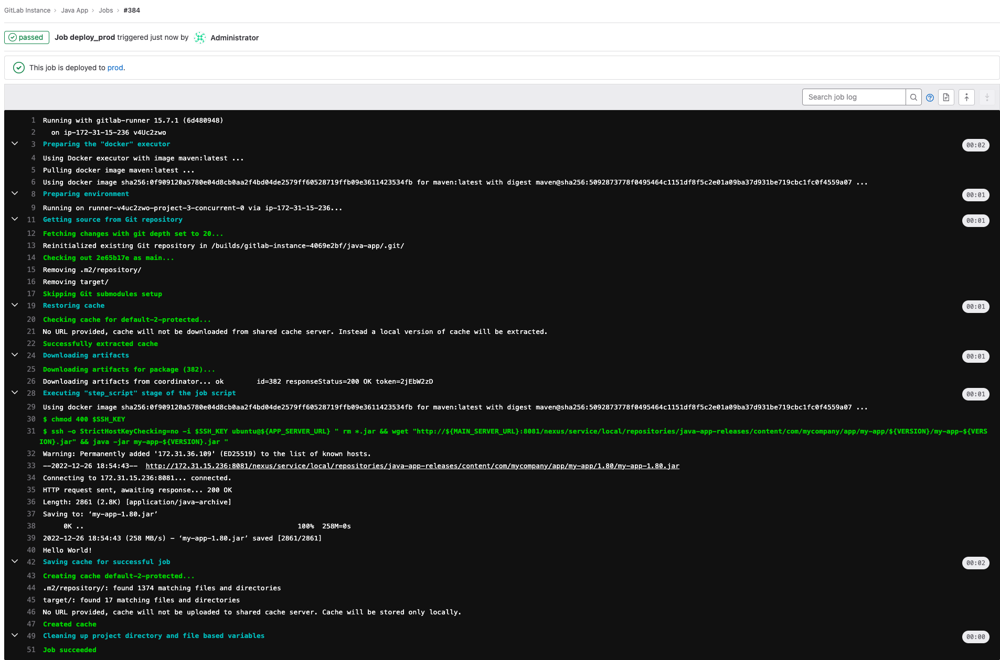
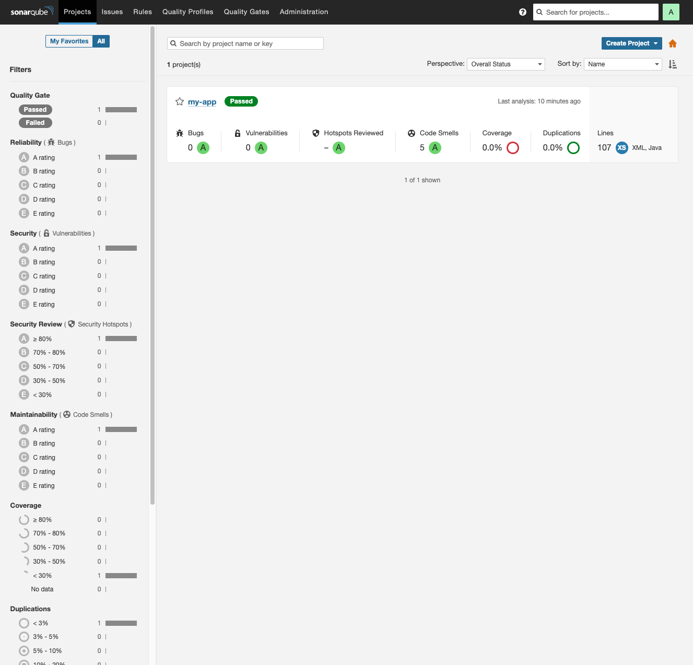

# Gitlab + Nexus + SonarQube
The app repository - [https://github.com/imakeeva1qa/simple-java-maven-app](https://github.com/imakeeva1qa/simple-java-maven-app).

The setup consists of:  
1. Gitlab, Nexus (accessible only from a private subnet), Sonarqube
2. Simple java app (Hello World!) which is being deployed on the app server 

## SETUP:
```bash
# for both jenkins and app_server
terraform init
terraform plan
terraform apply 
```

### Retrieve tmp passwords:  
```bash
# gitlab
docker exec -it gitlab grep 'Password:' /etc/gitlab/initial_root_password

# nexus
# admin / admin123

# sonarqube
# admin / admin
```
### Add the following to CI/CD variables:   
```
Nexus_REPO_URL: http://<nexus_ip_address>:8081/nexus/content/repositories/
Nexus_REPO_USER
Nexus_REPO_PASS
APP_SERVER_URL
MAIN_SERVER_URL (gitlab)
SONAR_HOST_URL
SONAR_TOKEN (protected and masked)
SSH_KEY for remote access to the app server (as a file; protected)
```

1. Create a repository in gitlab, set up SSH connection and push the application code
2. Install the gitlab runner
```bash
# Download the binary for your system
sudo curl -L --output /usr/local/bin/gitlab-runner https://gitlab-runner-downloads.s3.amazonaws.com/latest/binaries/gitlab-runner-linux-amd64

# Give it permission to execute
sudo chmod +x /usr/local/bin/gitlab-runner

# Create a GitLab Runner user
sudo useradd --comment 'GitLab Runner' --create-home gitlab-runner --shell /bin/bash

# Install and run as a service
sudo gitlab-runner install --user=gitlab-runner --working-directory=/home/gitlab-runner
sudo gitlab-runner start

# Register
sudo gitlab-runner register --url http://gitlab.example.com/ --registration-token $REGISTRATION_TOKEN

## in case of issues with the runner ##
nano /etc/gitlab-runner/config.toml # add "clone_url = "http://<your_gitlab_server_url>/""
gitlab-runner restart
```
4. Set up Nexus repository and users if needed.
5. Add branch 'develop' and environments to the gitlab
6. deploy is working - yes
7. Set up SonarQube  
By default when running as a docker container, it may require some adjustment because of ElasticSearch system requirements:  
```bash
# run these commands on the server
sysctl -w vm.max_map_count=524288
sysctl -w fs.file-max=131072
ulimit -n 131072
ulimit -u 8192
docker compose up -d
```
The next step is to add the project to SonarQube, it can be done just following the instructions - 
[http://<your_sonar_server>:9000/projects/create?mode=gitlab](http://<your_sonar_server>:9000/projects/create?mode=gitlab)


# SUMMARY
The project handles the following steps:
1. Pushing changes to develop - triggers the pipeline with building, pushing artifacts to Nexus and deployment to DEV server 

**_NOTE_**: I used the pipeline ID as the app version and the same server for prod and dev, which is not a best practice, it was simply just convenient 
to develop the project in such a way.


2. Creating a Merge Request - triggers the pipeline of 1 step (SonarQube)

3. Merging Changes - triggers the pipeline with building, pushing artifacts to Nexus and deployment to PROD server 
(however the last step should be triggered manually i.e. approved or so).  


Deployment is just a pulling .jar file from Nexus repository and running the app (Hello World!).



