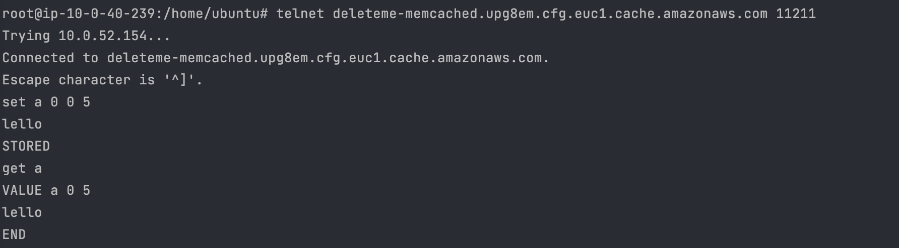

# AWS BASICS

Some points implemented via terraform (1-5, 10)

1. VPC with 2 public, 1 private subnets (1 more private added later on), multi AZ (2).
2. Security Group (http, https, ssh)
3. Key Pair
4. EC2 (2 instances with a dummy website)
5. ELB (ALB in public subnets to point to EC2s)
Target group is reached by the Load Balancer:  

  

  


Repointing web-sg:  


Disabling Instance:  


Inaccessible directly:  


6. RDS
Added another private subnet.  
Created db Subnet Group with private subnets.


Added SG inbound rule 5432 -> source: web-sg


7. Elasticache
   Created subnet groups
   Created SG inbound rule 6379
   Created SG inbound rule 11211
* Redis


* Memcached  





8. Cloudfront Distribution


S3 rule:  


```bash
# create files:
echo "DUMMYDUMMYDUMMY" > dummy{0001..0100}.c
```

9. Implemented using IAM role for S3 and _terraform/scripts/s3.sh_.


10. Implemented using ALB, see _terraform/asg+elb_. Autoscaling implements using cloudwatch_alarms.


