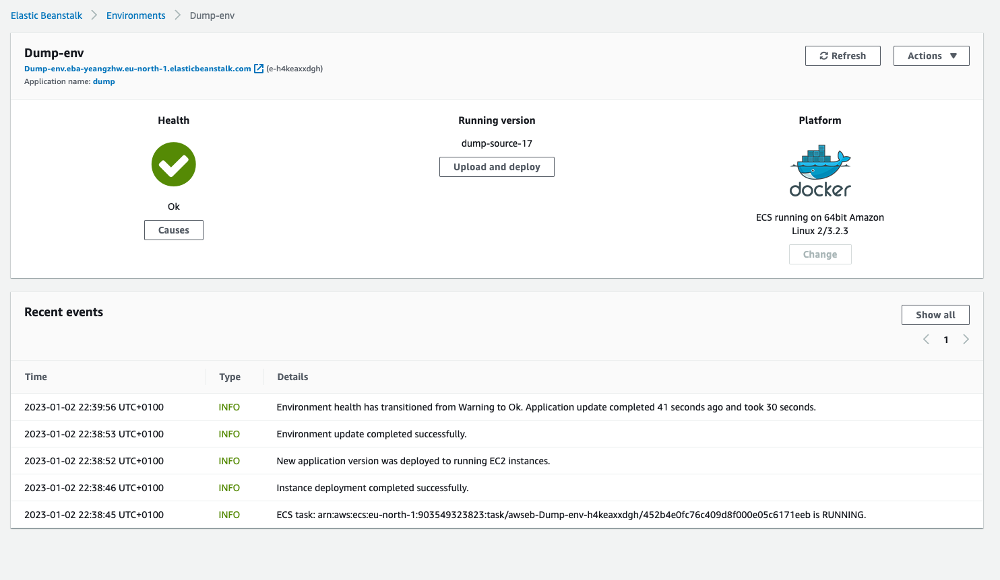
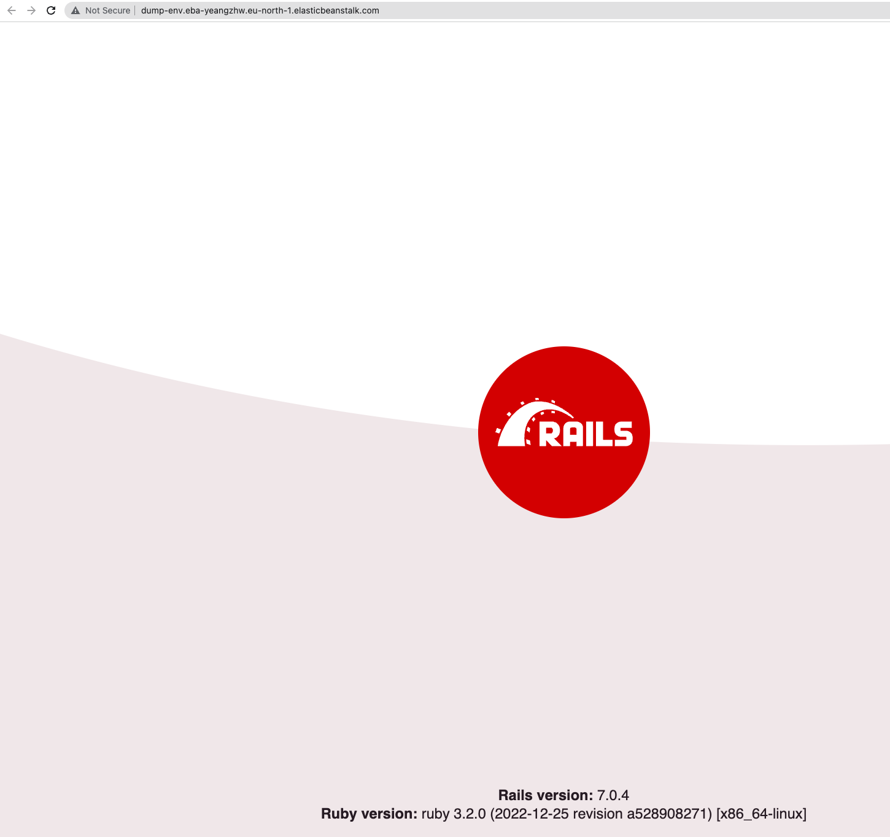

# Dummy ruby app + nginx + ElasticBeanstalk

The app doesn't do anything except showing a hello page.   

1. Install ruby  
```bash
# Using these tutorials 
# Sources: [https://medium.com/@t.skukx/deploying-rails-to-aws-elastic-beanstalk-using-gitlab-ci-77c7a98fbcc0]  
#          [https://gorails.com/setup/ubuntu/22.04] 

# Run 
bundle exec puma -C config/puma.rb

# sample output
#Puma starting in single mode...
#* Puma version: 5.6.5 (ruby 3.2.0-p0) ("Birdie's Version")
#*  Min threads: 5
#*  Max threads: 5
#*  Environment: development
#*          PID: 1
#* Listening on unix:////myapp/tmp/sockets/puma.sock
#* Listening on http://0.0.0.0:3000
#Use Ctrl-C to stop

```
2. Dockerise the app. See Dockerfile  
```dockerfile
FROM ruby:3.2.0

WORKDIR /myapp

COPY . /myapp

RUN \
  curl -sL https://deb.nodesource.com/setup_12.x | bash - \
  && curl -sS https://dl.yarnpkg.com/debian/pubkey.gpg | \
    apt-key add - \
  && echo "deb https://dl.yarnpkg.com/debian/ stable main" | \
    tee /etc/apt/sources.list.d/yarn.list \
  && apt-get update \
  && apt-get install -y \
  build-essential \
  nodejs \
  yarn \
  && cd /myapp \
  && gem install bundler \
  && bundle install \
  && yarn install 

EXPOSE 3000

CMD ["bundle", "exec", "puma", "-C", "config/puma.rb"]

```
Note:  
By default it may not work, add "config.hosts << /dump-env.*.eu-north-1.elasticbeanstalk.com/" 
to config/environments/development.rb.

3. Run 
```bash
docker build . 
docker push    # to your repo, e.g. docker push public.ecr.aws/xxxxxx/myapp:latest
```

4. Pack a zip archive contained Dockerrun.aws.json and nginx config file
```
Dockerrun.aws.json
config
    nginx
        conf.d
            default.conf
```

5. Upload the file to the existing or new EB application

# OUTPUT
EB summary:  



Application:  


