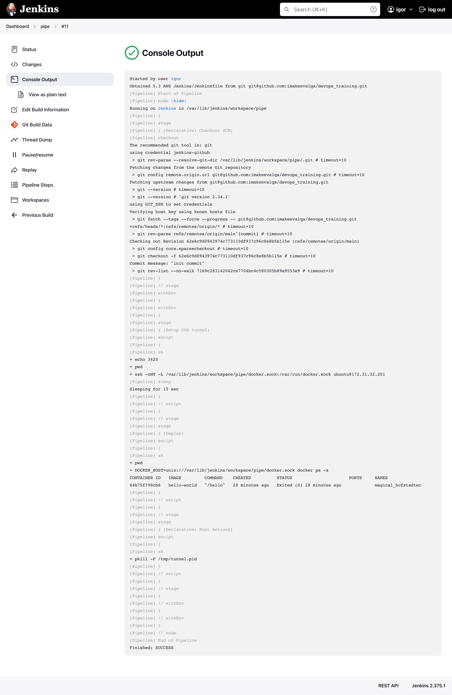

# AWS + Jenkins + Docker (remote socket)

SETUP:
```bash
# for both jenkins and app_server
terraform init
terraform plan
terraform apply 
```

Jenkins requires the following steps to be set up:
1. install standard plugins
4. add ssh-key for github (credentials)
5. add ssh-key for web-server access - to jenkins /var/lib/jenkins/.ssh, and .pub to authorized keys on web side
6. Create a pipeline with SCM git. All steps are listed in the Jenkinsfile

RESULTS:  
Successful build:  



