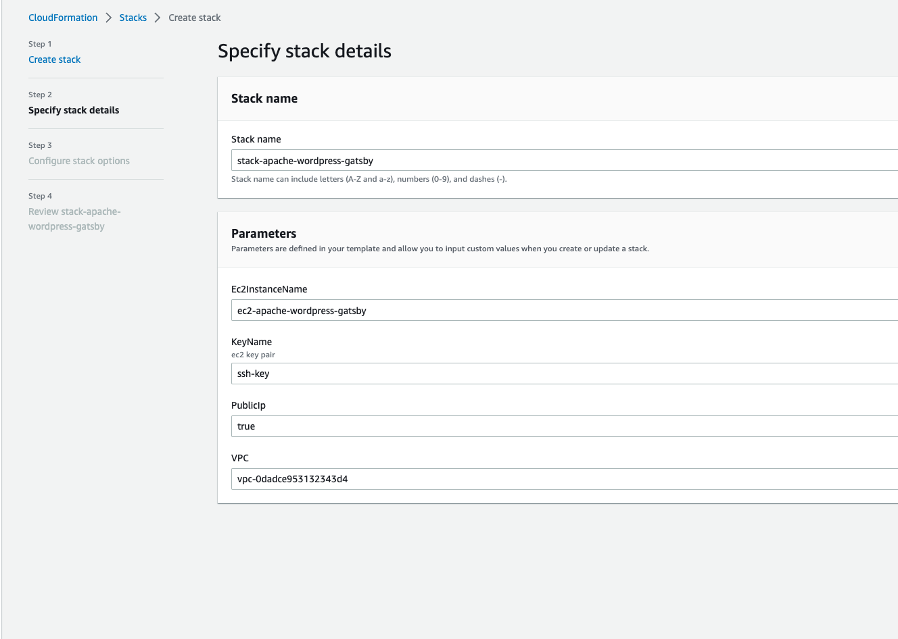

# Cloudformation Apache+PHP+Wordpress+NodeJS+Gatsby

Upload /cloudformation/cf.yaml to Cloudformation service to create a stack or use aws cloudformation CLI.

The Stack creates:  
1. EC2 instance with provisioned stack Apache, NodeJS, PHP, Wordpress (/app1), Gatsby (hello world - /app2)
2. ALB in the default subnets forwarding to the EC2 on port 80
3. Security and target groups and alb listener

## OUTPUTS:
Stack initiation  
**NOTE: the instance won't have internet access if PublicIp = false. To make it work it needs to place the instance to the private subnet and use NAT Gateway** The subject was covered within [5.1 AWS Basics](https://github.com/imakeeva1qa/devops_training/tree/main/5.1%20AWS%20Basics) task using terraform, so this part was skipped for now.

Output with public IP address  

Output without public IP address  

Wordpress  

Gatsby  

