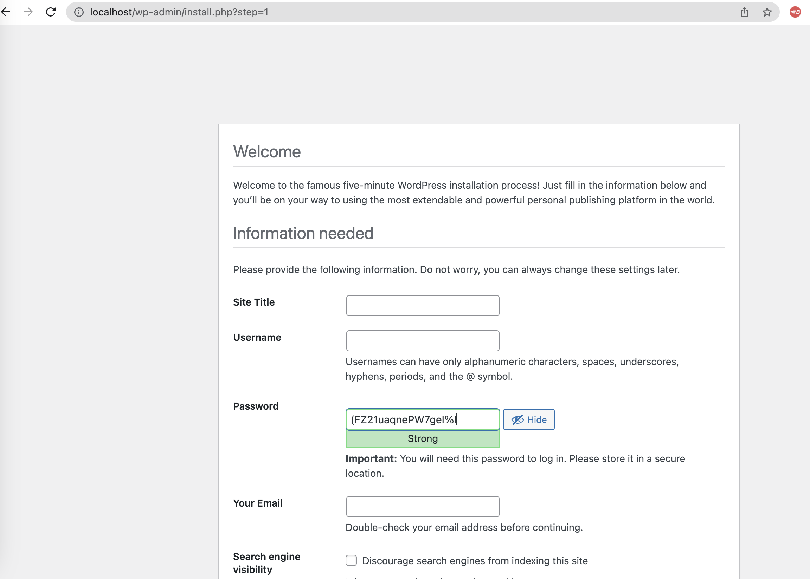
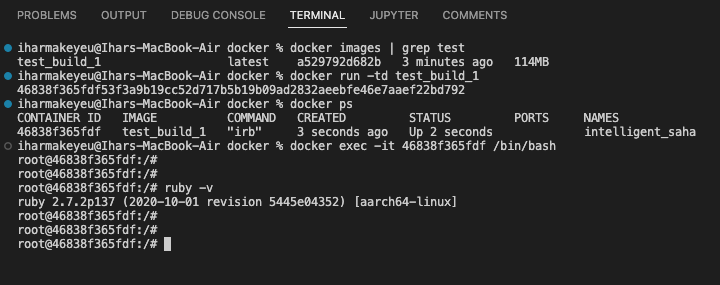

# Docker

# Docker essentials
```bash
# nginx
docker search nginx
docker pull nginx
docker run -d -p 80:80 nginx

# mysql
docker pull mysql
docker run --name mysql-container \
-e MYSQL_ROOT_PASSWORD=password \
-v my-vol:/var/lib/mysql \
-d mysql:latest

# mysql cli
docker exec -it <container_id> /bin/bash
mysql > CREATE USER 'igor'@'localhost' IDENTIFIED BY 'password';
mysql > GRANT ALL PRIVILEGES ON *.* TO 'igor'@'localhost';
mysql > CREATE DATABASE devops;
mysql > show databases;

#
# mysql> show databases;
# +--------------------+
# | Database           |
# +--------------------+
# | devops             |
# | information_schema |
# | mysql              |
# | performance_schema |
# | sys                |
# +--------------------+
# 5 rows in set (0.01 sec)
#
#
```

# Dockerfile



# Docker-compose


