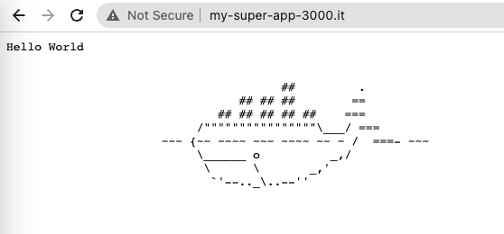

# K8s
Setup:  
- Mac Silicon m1  
- Docker driver

**NOTE**: The network is limited if using the Docker driver on Darwin, Windows, or WSL, and the Node IP is not reachable directly.

Getting started:  
```bash
kubectl apply -f https://projectcontour.io/quickstart/contour.yaml
kubectl get all -n projectcontour

kubectl create namespace my-app

sudo nano /etc/hosts    # xxx.xxx.xxx.xxx my-super-app-3000.it
```


Deployment:  
```bash
# being in k8s directory:
kubectl apply -f .

minikube tunnel
# OUTPUT:
#✅  Tunnel successfully started
#📌  NOTE: Please do not close this terminal as this process must stay alive for the tunnel to be accessible ...
#❗  The service/ingress envoy requires privileged ports to be exposed: [80 443]
#🔑  sudo permission will be asked for it.
#🏃  Starting tunnel for service envoy.
#❗  The service/ingress hello-world-ingress requires privileged ports to be exposed: [80 443]
#🏃  Starting tunnel for service hello-world-ingress.
```
  

Commads:  
```bash
kubectl get pods -A 
kubectl get svc -n --all-namespaces
kubectl get all
```
OUTPUT:  [output.png](images/output.png)  
```
iharmakeyeu@Ihars-MacBook-Air k8s % kubectl get pods -A
NAMESPACE        NAME                                      READY   STATUS      RESTARTS        AGE
kube-system      coredns-565d847f94-bln2h                  1/1     Running     2 (3d23h ago)   5d5h
kube-system      etcd-minikube                             1/1     Running     2 (3d23h ago)   5d5h
kube-system      kube-apiserver-minikube                   1/1     Running     2 (3d23h ago)   5d5h
kube-system      kube-controller-manager-minikube          1/1     Running     2 (98m ago)     5d5h
kube-system      kube-proxy-wf5fn                          1/1     Running     2 (98m ago)     5d5h
kube-system      kube-scheduler-minikube                   1/1     Running     2 (98m ago)     5d5h
kube-system      storage-provisioner                       1/1     Running     5 (97m ago)     5d5h
my-app           hello-world-deployment-5cc7bf5ccd-522fz   1/1     Running     0               24m
projectcontour   contour-6d4545ff84-w6znc                  1/1     Running     0               24m
projectcontour   contour-6d4545ff84-zjlp4                  1/1     Running     0               24m
projectcontour   contour-certgen-v1.23.0-8xxln             0/1     Completed   0               24m
projectcontour   envoy-wtlfr                               2/2     Running     0               24m
iharmakeyeu@Ihars-MacBook-Air k8s % 
iharmakeyeu@Ihars-MacBook-Air k8s % 
iharmakeyeu@Ihars-MacBook-Air k8s % kubectl get svc --all-namespaces
NAMESPACE        NAME                  TYPE           CLUSTER-IP       EXTERNAL-IP   PORT(S)                      AGE
default          kubernetes            ClusterIP      10.96.0.1        <none>        443/TCP                      5d5h
kube-system      kube-dns              ClusterIP      10.96.0.10       <none>        53/UDP,53/TCP,9153/TCP       5d5h
my-app           hello-world-service   NodePort       10.99.60.25      <none>        80:30786/TCP                 24m
projectcontour   contour               ClusterIP      10.97.143.183    <none>        8001/TCP                     24m
projectcontour   envoy                 LoadBalancer   10.100.253.217   127.0.0.1     80:30588/TCP,443:31864/TCP   24m
iharmakeyeu@Ihars-MacBook-Air k8s % 
iharmakeyeu@Ihars-MacBook-Air k8s % 
iharmakeyeu@Ihars-MacBook-Air k8s % kubectl get all --all-namespaces
NAMESPACE        NAME                                          READY   STATUS      RESTARTS        AGE
kube-system      pod/coredns-565d847f94-bln2h                  1/1     Running     2 (3d23h ago)   5d5h
kube-system      pod/etcd-minikube                             1/1     Running     2 (3d23h ago)   5d5h
kube-system      pod/kube-apiserver-minikube                   1/1     Running     2 (3d23h ago)   5d5h
kube-system      pod/kube-controller-manager-minikube          1/1     Running     2 (98m ago)     5d5h
kube-system      pod/kube-proxy-wf5fn                          1/1     Running     2 (98m ago)     5d5h
kube-system      pod/kube-scheduler-minikube                   1/1     Running     2 (98m ago)     5d5h
kube-system      pod/storage-provisioner                       1/1     Running     5 (98m ago)     5d5h
my-app           pod/hello-world-deployment-5cc7bf5ccd-522fz   1/1     Running     0               24m
projectcontour   pod/contour-6d4545ff84-w6znc                  1/1     Running     0               25m
projectcontour   pod/contour-6d4545ff84-zjlp4                  1/1     Running     0               25m
projectcontour   pod/contour-certgen-v1.23.0-8xxln             0/1     Completed   0               25m
projectcontour   pod/envoy-wtlfr                               2/2     Running     0               25m

NAMESPACE        NAME                          TYPE           CLUSTER-IP       EXTERNAL-IP   PORT(S)                      AGE
default          service/kubernetes            ClusterIP      10.96.0.1        <none>        443/TCP                      5d5h
kube-system      service/kube-dns              ClusterIP      10.96.0.10       <none>        53/UDP,53/TCP,9153/TCP       5d5h
my-app           service/hello-world-service   NodePort       10.99.60.25      <none>        80:30786/TCP                 24m
projectcontour   service/contour               ClusterIP      10.97.143.183    <none>        8001/TCP                     25m
projectcontour   service/envoy                 LoadBalancer   10.100.253.217   127.0.0.1     80:30588/TCP,443:31864/TCP   25m

NAMESPACE        NAME                        DESIRED   CURRENT   READY   UP-TO-DATE   AVAILABLE   NODE SELECTOR            AGE
kube-system      daemonset.apps/kube-proxy   1         1         1       1            1           kubernetes.io/os=linux   5d5h
projectcontour   daemonset.apps/envoy        1         1         1       1            1           <none>                   25m

NAMESPACE        NAME                                     READY   UP-TO-DATE   AVAILABLE   AGE
kube-system      deployment.apps/coredns                  1/1     1            1           5d5h
my-app           deployment.apps/hello-world-deployment   1/1     1            1           24m
projectcontour   deployment.apps/contour                  2/2     2            2           25m

NAMESPACE        NAME                                                DESIRED   CURRENT   READY   AGE
kube-system      replicaset.apps/coredns-565d847f94                  1         1         1       5d5h
my-app           replicaset.apps/hello-world-deployment-5cc7bf5ccd   1         1         1       24m
projectcontour   replicaset.apps/contour-6d4545ff84                  2         2         2       25m

NAMESPACE        NAME                                COMPLETIONS   DURATION   AGE
projectcontour   job.batch/contour-certgen-v1.23.0   1/1           4s         25m
iharmakeyeu@Ihars-MacBook-Air k8s % 
iharmakeyeu@Ihars-MacBook-Air k8s % kubectl get ingresses -n my-app
NAME                  CLASS    HOSTS                  ADDRESS     PORTS   AGE
hello-world-ingress   <none>   my-super-app-3000.it   127.0.0.1   80      25m
```
